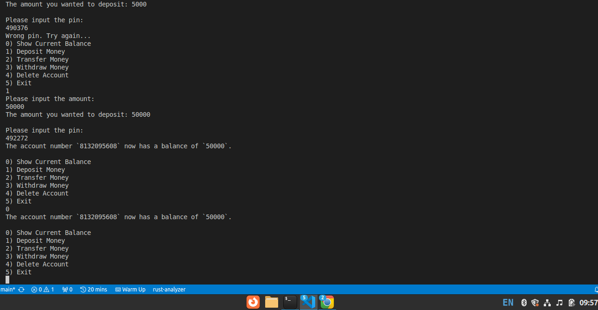

# Project Name
Banking System Project with rust

# Project Description
Banking system creates and delete accounts.

Users can :

1. Withdraw money
2. Deposit money
3. Transfer money to another account
4. Check current balance of account
5. Delete account
6. Quitting the application
<div>



</div>
# Dependencies
1. clap: Command-line parser library.
derive allows us to inherit triat definitions
```
cargo add clap -F derive
```
2. rusqlite: Wrapper crate for SQLite.

```
cargo add rusqlite -F backup
```

3. rand: provides utilities to generate random numbers, to convert them to useful types and distributions, and some randomness-related algorithms. 
```
 cargo add rand
 ```

 
